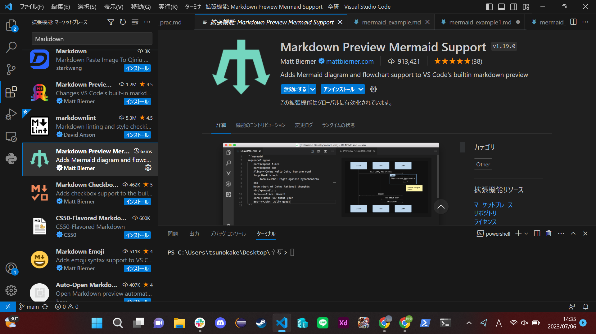

## VSCodeでmermaidを利用する方法や便利な拡張機能

**Mermaid を使用すると、テキストとコードを使用して図やビジュアライゼーションを作成できます。**

Mermaid は、Markdown にインスピレーションを得たテキスト定義とレンダラーを使用して複雑な図を作成および変更する JavaScript ベースの図作成およびグラフ作成ツールです。 Mermaid の主な目的は、ドキュメントが開発に追いつくのを支援することです。

### mermaidを利用して出来ること
mermaid+VScodeでできるのは

- フローチャート
- クラス図
- シーケンス図
- 状態遷移図
- ガントチャート
- 円グラフ
  
です。

## 3.便利な拡張機能
***
- #### Markdown Preview Mermaid Support
Visual Studio Code で **Markdown Preview Mermaid Support** をインストールできます。
検索すると以下のような画面で見つけることができます。

#### 使い方
拡張機能をインストールするだけで、特に設定を変更することなくプレビュー時に図が表示されるようになります。

- #### Mermaid Markdown Syntax Highlighting
