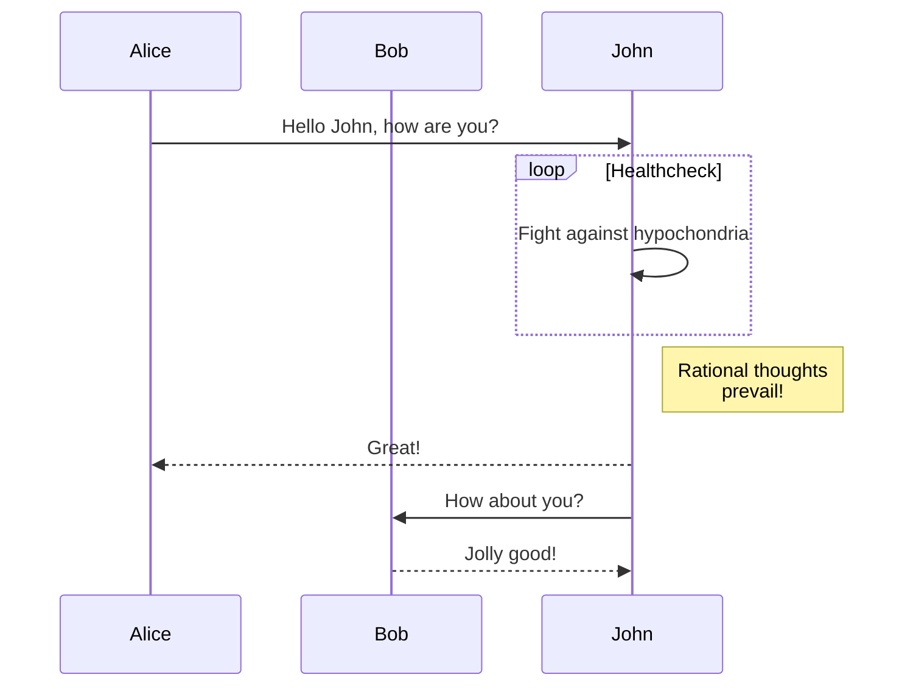
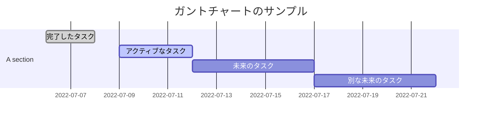
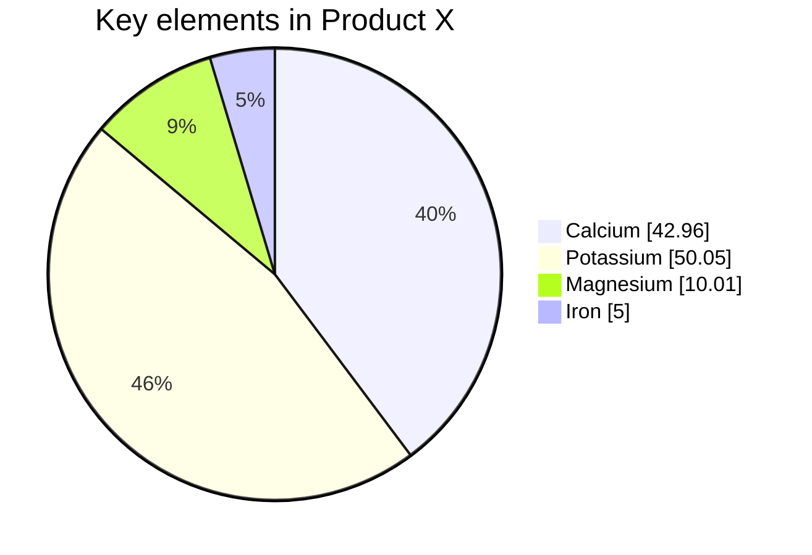

## 図の種類
#### フローチャート


#### シーケンス図


#### ガントチャート


#### クラス図
```mermaid
Class diagram
classDiagram
Class01 <|-- AveryLongClass : Cool
Class03 *-- Class04
Class05 o-- Class06
Class07 .. Class08
Class09 --> C2 : Where am i?
Class09 --* C3
Class09 --|> Class07
Class07 : equals()
Class07 : Object[] elementData
Class01 : size()
Class01 : int chimp
Class01 : int gorilla
Class08 <--> C2: Cool label
```

#### 円グラフ


引用元：https://notepm.jp/help/mermaid