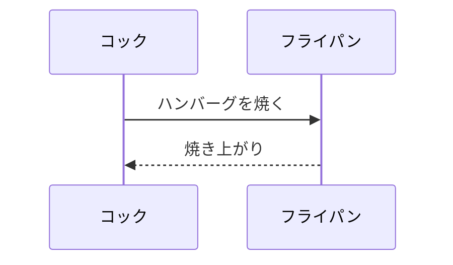
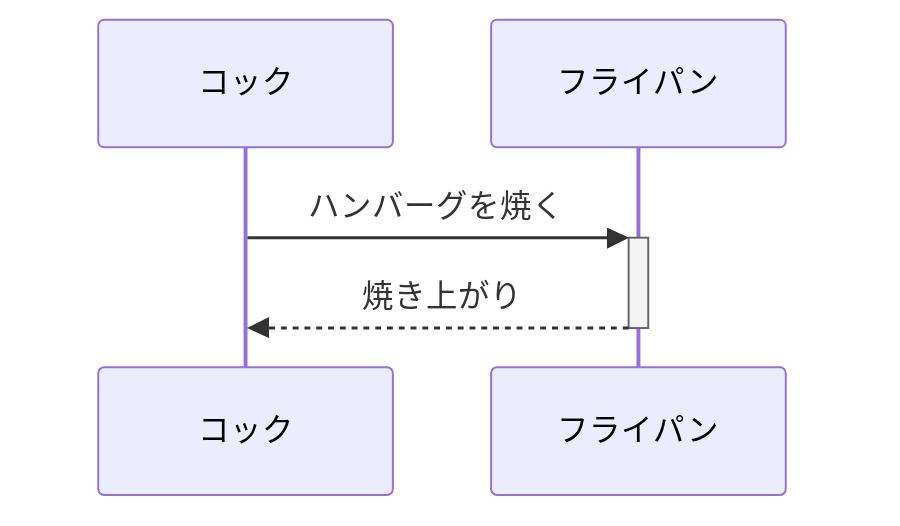
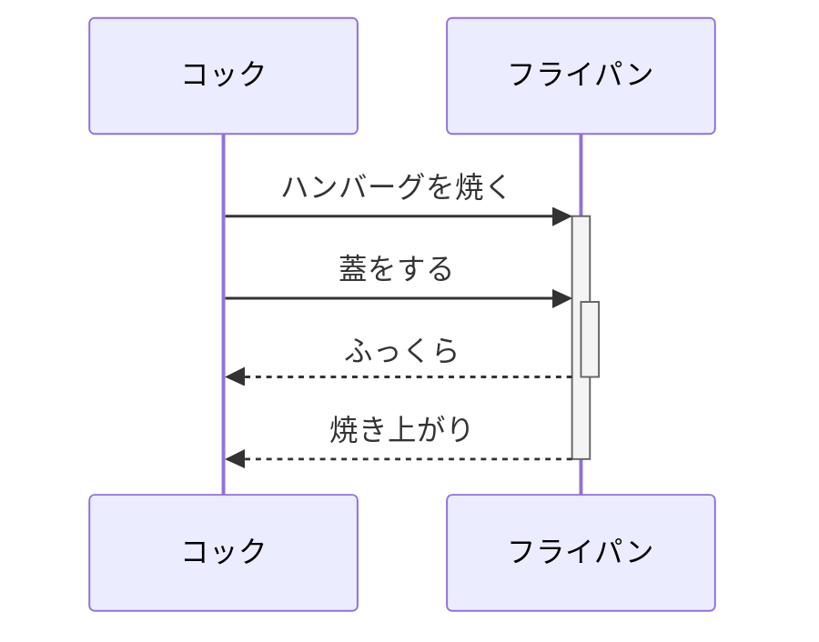
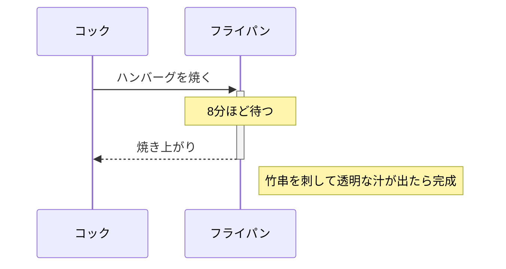
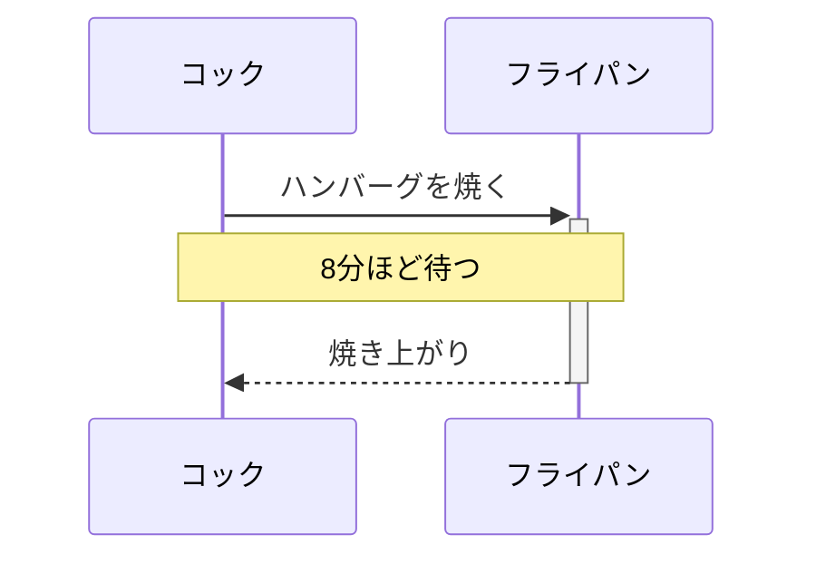
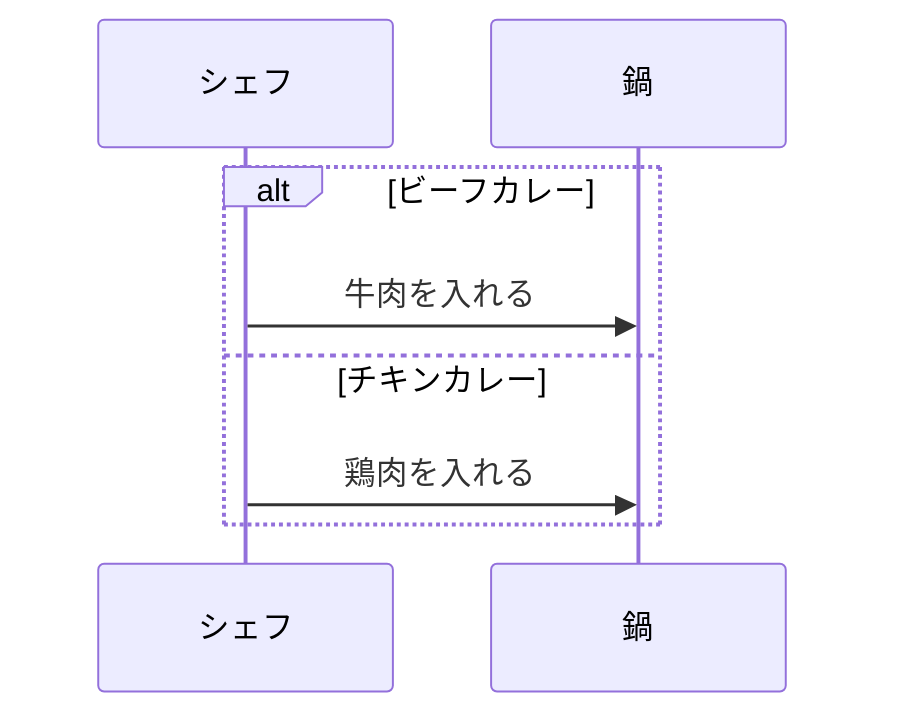
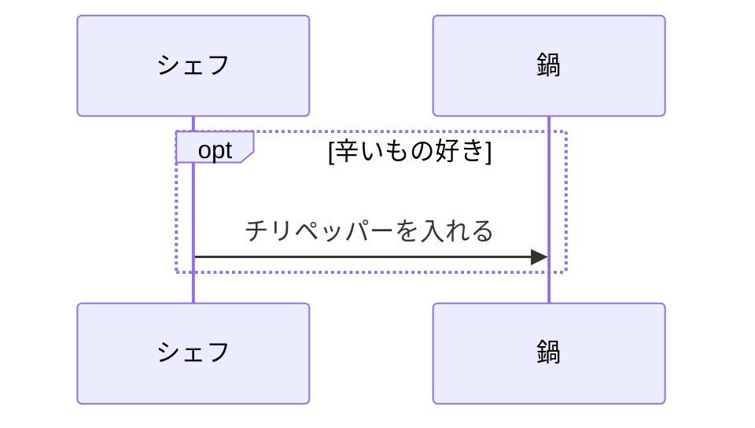
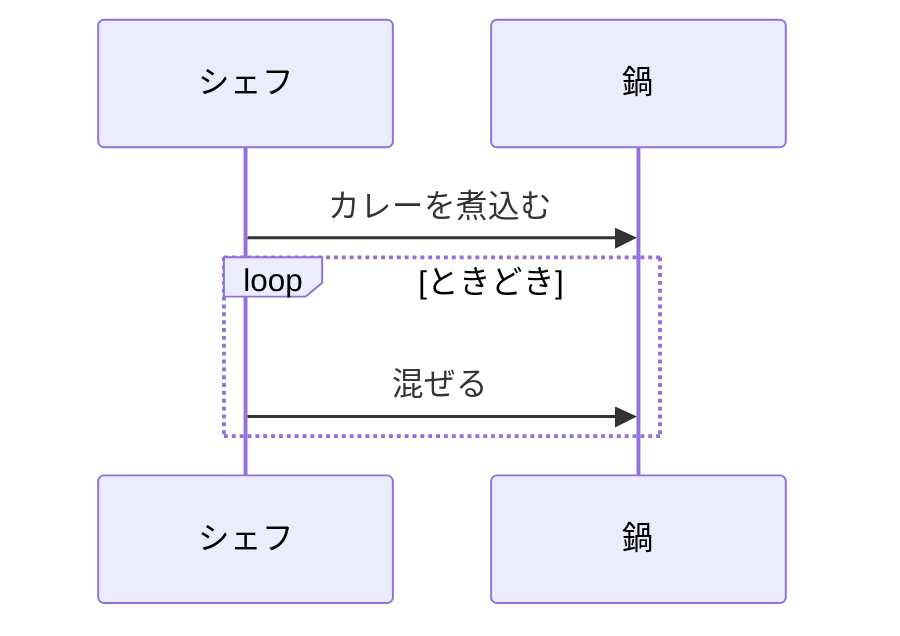
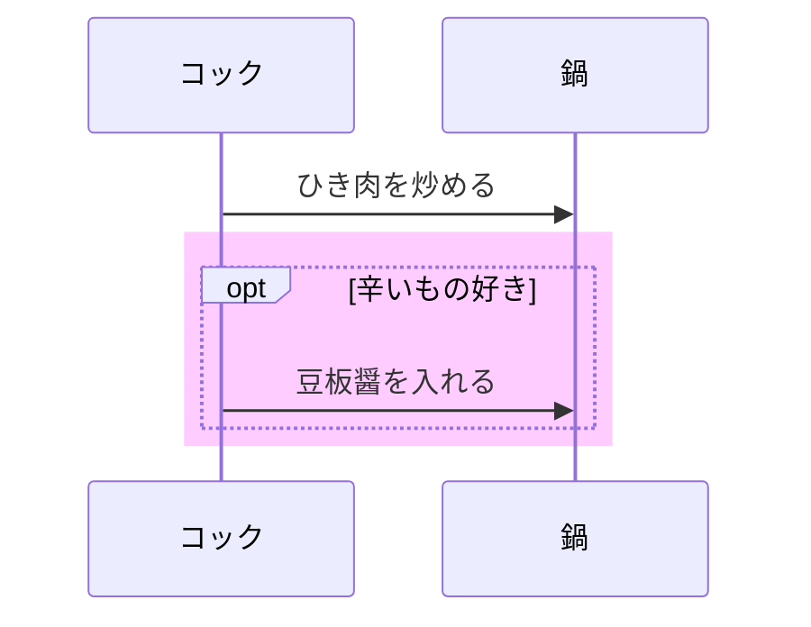

## mermaidで記述できるダイアグラムのチュートリアル

### シーケンス図

#### 基本の書き方

ただし、この書き方だとライフラインの名前「コック」を「シェフ」に変えたいと思った場合、2箇所直さないといけません。
そこで、ライフラインはエイリアス(別名)をつけておいた方がいいです。

**participant cook as コック**
という書き方でcookというライフラインに「コック」という別名(ラベル)を与えることができます。
これで「コック」を「シェフ」や「板前」に変えたいと思ったら、この行を修正するだけで済みます。

ライフラインにはなるべく抽象的な名前をつけておきましょう。

#### 実行仕様
ライフライン上に実行仕様をつけたい場合は、開始と終了の矢印の後に+と-をつけます。

実行仕様は入れ子にすることもできます。

#### ノート
シーケンス図にノート(メモ)をつけることもできます。

ノートをつける位置によって、少し指定の仕方が変わります。

|**ノートの位置**|**コード**|
| ライフラインの上 | Note over ライフライン: ノートの内容 |
| ライフラインの右 | Note right of ライフライン: ノートの内容|
| ライフラインの左 | Note left of ライフライン: ノートの内容 |

ライフラインを,(コンマ)でつなげて指定すれば、複数のライフライン上にまたがったノートを書くこともできます。

#### 複合フラグメント
シーケンスにはループや条件分岐がつきものです。
もちろんmermaidでも表現することができます。

#### 条件分岐(alt)
下記のようにalt～else～endを使って書きます。
alt 条件1
    処理1
else 条件2
    処理2
end

#### 条件指定(opt)
opt 条件
    処理
end

#### ループ(loop)
loop 条件
    処理
end

#### 背景色
rect rgba(r, g, b, a)
    ....
end

背景色をつけたい部分をrect rgba()～endでくくります。
rgba()で「赤(red)」「緑(green)」「青(blue)」「透過度(alpha)」をそれぞれ指定します。

#### コメント
mermaidブロックの中にコメント文を書きたいときは %% これはコメントです のようにします

