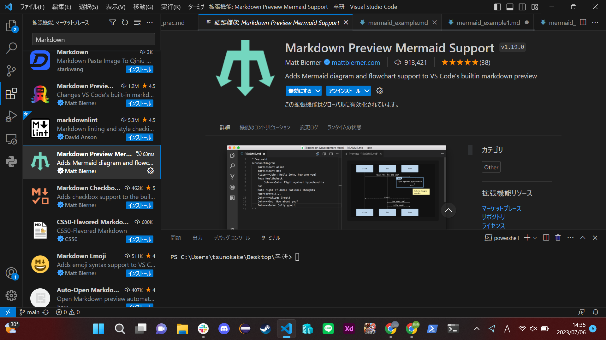

### 1-1 システムの背景と目的
 | 制作者 | 作成日付 | 承認者 | 承認日付 | 承認日付 |
 | ------ | -------- | ------ | -------- | -------- |
 | 盛岡太郎    | 2022/04/01      | ○○○    | ○○○      | ○○○      |
#### 背景
自社では取引業者が多岐にわたり、県内外の企業を対象にしておりIT業界企業100社、卸売業者50社、製造業30社との取引先企業の情報をある部署のコンピュータ1台で管理している。
各部員の社員は情報取得する場合、その部署に行く必要がある為、効率が悪く利用しにくい。
　また、今後取引企業が増えることが予想され効率よく情報を取り出す必要がある。

#### 目的
1台のコンピュータで管理している現システムをネットワークを利用したWebシステムに変更し、ブラウザを利用して各部署からでも情報を取り出せるように効率の向上をする。
また、検索条件として企業の所在県、業種を設定検索できることとする。

### 1-2 システム全体図
| 制作者 | 作成日付 | 承認者 | 承認日付 | 承認日付 |
 | ------ | -------- | ------ | -------- | -------- |
 | 盛岡太郎    | 2022/04/01      | ○○○    | ○○○      | ○○○      |
**利用者操作**
- 初めて利用する場合は、ユーザ登録を行う
- ブラウザよりログインして利用する
- ブラウザを利用して、条件を入力し情報を取得する
  
**管理者操作**
- ブラウザよりログインして利用する
- ブラウザより企業情報を登録・保守を行いデータベースを管理する

#### 1-3 要求一覧・優先度
| 制作者 | 作成日付 | 承認者 | 承認日付 | 承認日付 |
 | ------ | -------- | ------ | -------- | -------- |
 | 盛岡太郎    | 2022/04/01      | ○○○    | ○○○      | ○○○      |
要求一覧
 | No | 大分類 | 小分類 | 要件 | 優先度 | 備考 |
 | ------ | -------- | ------ | -------- | -------- | -------- |
 | 1    | 基本要件      | 利用環境    | サービスの利用にあたって、クライアント端末にあぷりけーしょんをインストールすることなくブラウザから利用できる      | 高      ||
 |2||ユーザ管理|ユーザーIDとパスワードを用いたログインができる|高||
 |3||デザイン|サイト全体として、統一されたページデザインにすること|中||
 |4|検索条件|所在県検索|指定した所在県より抽出ができる|高|複合条件でも検索可能とする| 
 |5||業種検索|指定した業種より抽出ができる|高|複合条件でも検索可能とする|
 |6||条件なし|全ての企業を抽出できる|高|複合条件でも検索可能とする|
 |7|企業情報登録|企業情報登録|管理画面から企業情報を登録することが出来る|高||
 |8|企業情報保守|企業情報編集|管理画面から企業情報を編集することが出来る|高||
 |9||企業情報削除|管理画面から企業情報を削除することが出来る|高||

#### 1-4 ユースケース図
| 制作者 | 作成日付 | 承認者 | 承認日付 | 承認日付 |
 | ------ | -------- | ------ | -------- | -------- |
 | 盛岡太郎    | 2022/04/01      | ○○○    | ○○○      | ○○○      |
