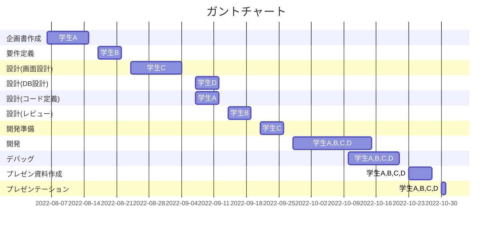

# 開発スケジュール
 | 制作者 | 作成日付 | 承認者 | 承認日付 | 承認日付 |
 | ------ | -------- | ------ | -------- | -------- |
 | 盛岡太郎    | 2022/04/01      | ○○○    | ○○○      | ○○○      |

Project Leader ----- 学生A
　→開発プロジェクトを総合的に統括する。
   主なミッションは企画からプレゼンまでのロードマップの作成やタスク管理、会議のファシリテシートである。

Development Leader ----- 学生B
   →目標成果物の責任を有する。
   主なミッションは開発方針の策定、開発スケジューリング、開発フェーズ内のタスク管理である。

Research Leader ----- 学生C
   →開発の達成に責任を有する。
   主なミッションは研究企画書の考案・作成、プロジェクトの軌道修正、プレゼンである。

Research Sub Leader ----- 学生D
   →開発の達成に責任を有する。
   主なミッションは開発リーダーの補助である。   

# WBS   
 | 制作者 | 作成日付 | 承認者 | 承認日付 | 承認日付 |
 | ------ | -------- | ------ | -------- | -------- |
 | 盛岡太郎    | 2022/04/01      | ○○○    | ○○○      | ○○○      |

